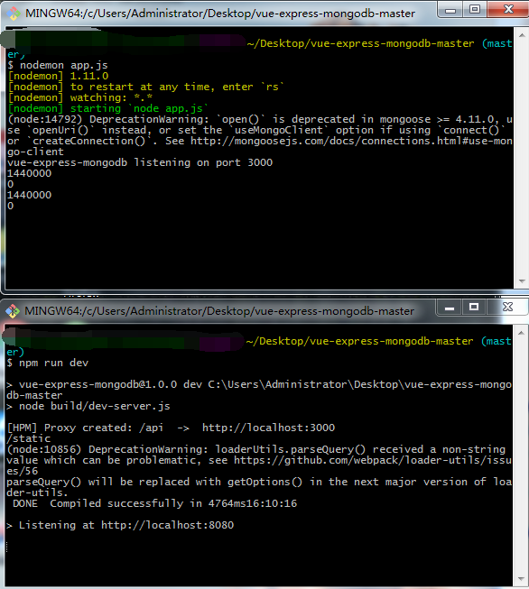
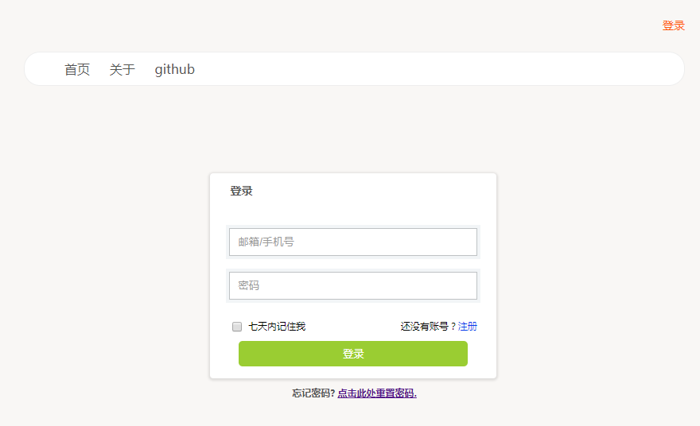
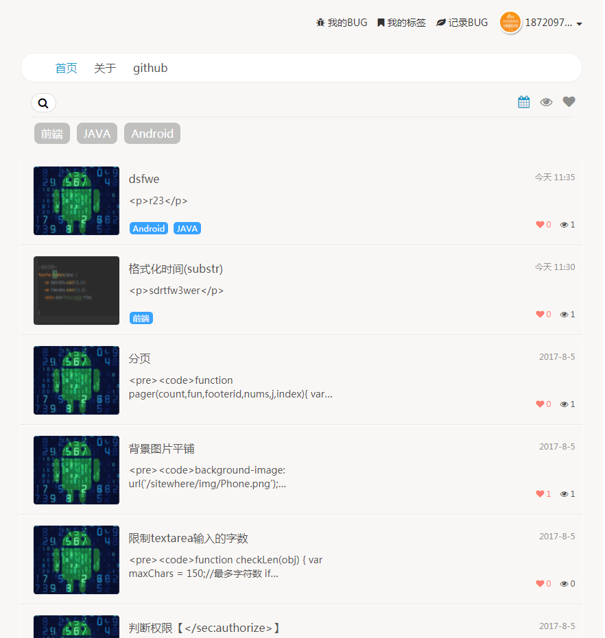
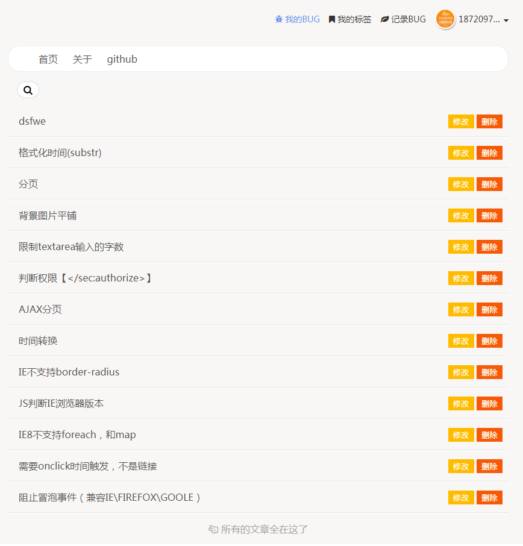
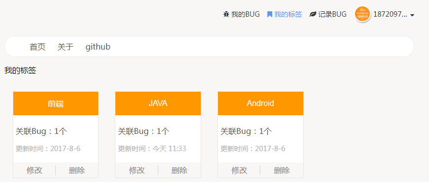

# 一个前后端分离案例

## 简介
采用了vue-cli脚手架搭建框架，前端使用该框架进行路由导航，后端使用express路由导航。

## 效果图







## 开发环境
需要本地安装[node](https://nodejs.org/en/),[npm](https://www.npmjs.com/)或[yarn](https://yarnpkg.com/),[mongodb](https://www.mongodb.com/)

## 启动步骤
```bash
npm install 

nodemon app.js  //启动后台

npm run dev //启动前端
```

## 访问http://localhost:8080
